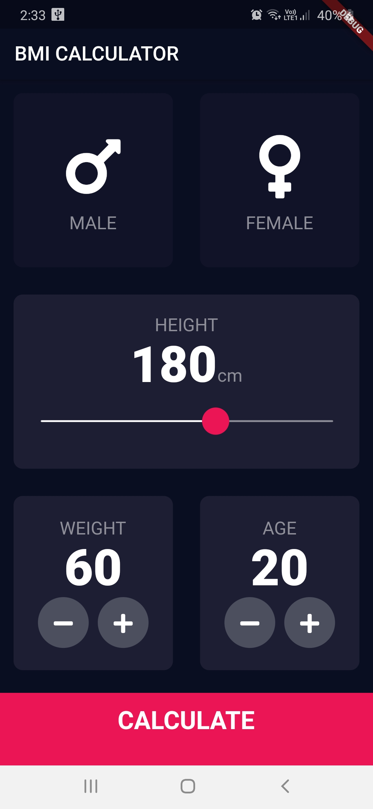

Installation

# flutter pub get

Usage

# flutter run

Try Android APK : <a href = "https://drive.google.com/drive/u/1/folders/1H5S9y2V3vs8EADW_boWEDKrJnZ_N6QMd"> Download From Google Drive</a>

This is the Simple  BMI Calculator app made with Flutter ...Don't forget to star ⭐ the repo it motivates me to share more open source

Created & Maintained By
<a href="https://www.linkedin.com/in/anikit-grover/#">Flutter Developer - Anikit Grover </a>

If you found this project helpful or you learned something from the source code and want to thank me, consider buying me a cup of ☕

